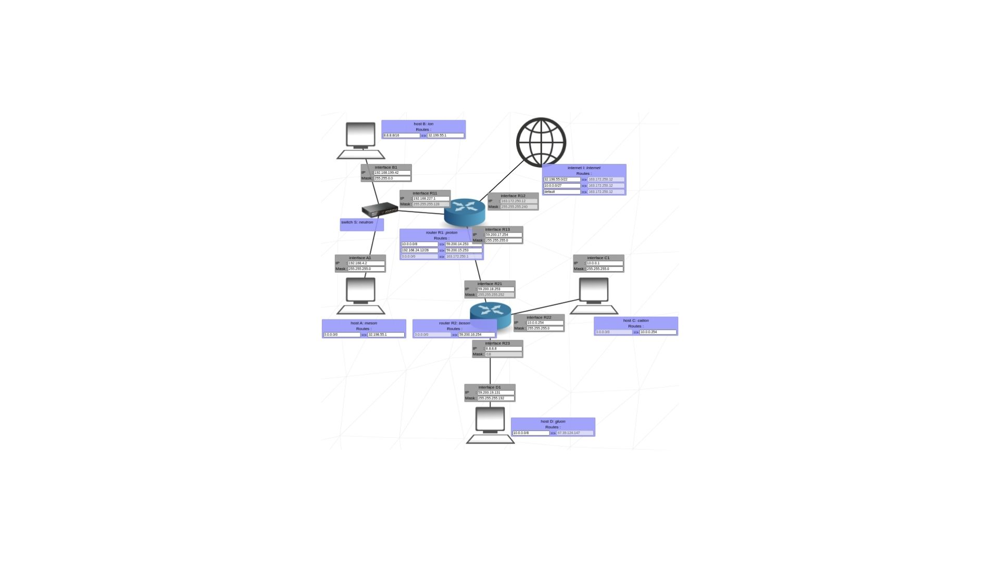

# Net_Practice

Net_Practice is an educational project designed to introduce you to the foundational concepts of networking. By simulating real-world scenarios in a controlled, browser-based environment, the project provides hands-on experience in diagnosing and solving network configuration issues.

## 📖 Project Concept

The core idea of Net_Practice is to enhance your understanding of how computer networks operate by:
- Exploring **TCP/IP addressing** and its practical applications.
- Configuring virtual networks, including devices like routers, to achieve specific goals.
- Developing problem-solving skills to identify and resolve connectivity issues.

This project replicates networking challenges you might encounter in the real world, making it a valuable stepping stone for mastering system administration and network management.

## 🎯 Objectives

- Understand the principles of IP addressing and subnetting.
- Learn to configure and troubleshoot small-scale networks.
- Gain experience in analyzing network logs to identify errors.
- Build confidence in solving practical networking problems without external tools.

## 🛠️ Training Environment

Net_Practice provides a user-friendly training interface accessible through a web browser. Each level presents:
1. A non-functional network diagram.
2. A set of objectives to achieve.
3. Tools to verify and export your configurations.

With 10 progressively challenging levels, the project ensures a thorough understanding of networking basics by the time you complete it.

## 💡 Why It Matters

Networking is the backbone of modern computing systems. Whether you're managing a corporate IT infrastructure or deploying applications in the cloud, the ability to configure and troubleshoot networks is an essential skill. Net_Practice bridges the gap between theory and practice, equipping you with the knowledge to excel in real-world scenarios.

---

Embark on your journey to mastering the art of networking with Net_Practice. Happy configuring!
